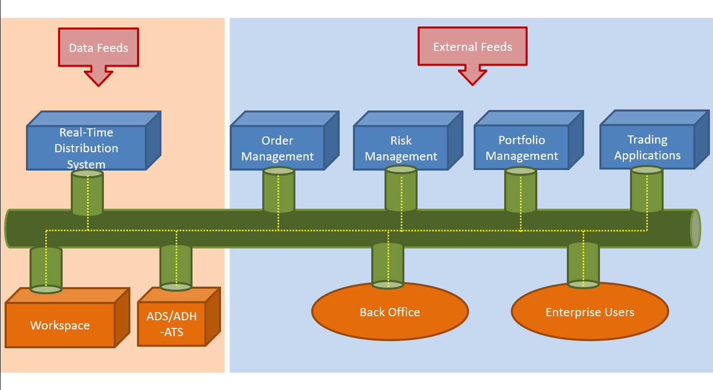
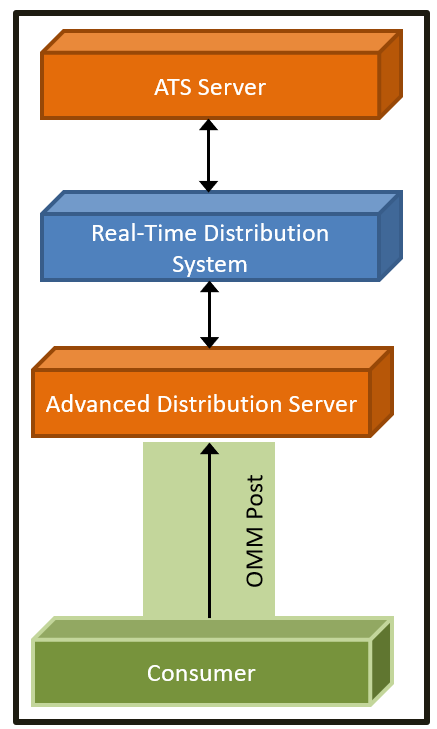
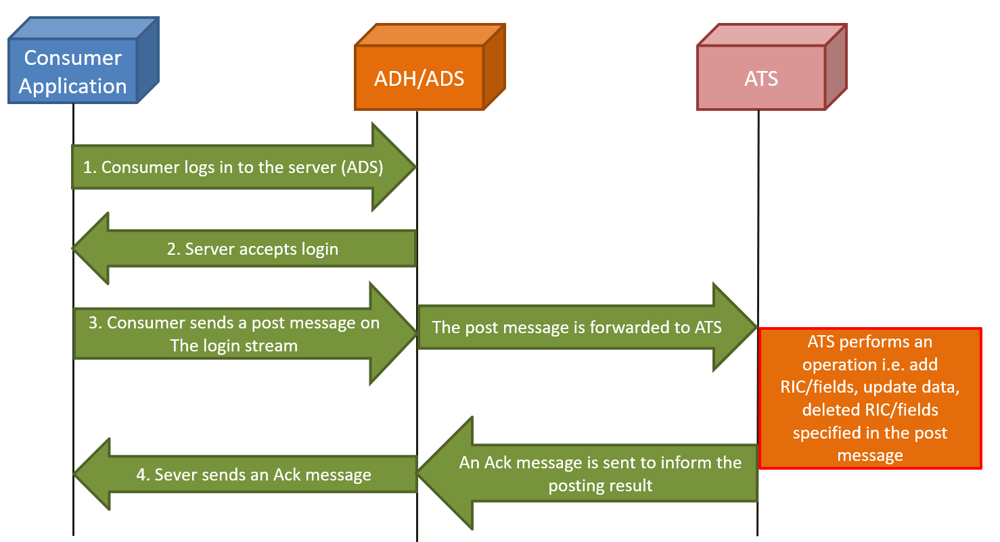

# Implementing Real-Time API applications to work with ATS - Part 1 (with C# content only)

## Note

This article content aims for updating the [Implementing Real-Time API applications to work with ATS - Part 1](https://developers.lseg.com/en/article-catalog/article/implementing-elektron-api-applications-work-ats-part-1) article with the following updates:

- Add EMA C# content
- Rebrading Refinitiv to LSEG
- Add ATS required fields

So other APIs content will not be included in this article. Please see the full version on the [Developer Portal](https://developers.lseg.com/) website.

## About this article

**Update**: October 2024

The intended audiences of this article are software developers/engineers interested in or are currently working with ATS (Real-Time Advanced Transformation Server) i.e. contribute records (RICs), fields, data to ATS or delete fields/RICs from ATS. The article will show how to use our strategic APIs, the Real-Time SDK (EMA and ETA)  and WebSocket API to achieve this. For more details of Real-Time SDK family, please refer to the [Real-Time SDK family](https://developers.lseg.com/en/use-cases-catalog/refinitiv-real-time) page.

The article is structured in two parts:

- Part 1 - ATS and Posting Overview, what they are and how they can work together. The prerequisites and the overview steps to work with ATS. Finally, how to create a new RIC and its fields to ATS.
- Part 2 - Other operations which are updating field values, deleting fields or a RIC by using Real-Time APIs. The troubleshooting how to solve some common problems when you work with ATS.

Before working with ATS using Real-Time APIs, you should have a basic understanding of how to log in to the server using Real-Time APIs which can be learned from the following

- [EMA C++ Tutorials](https://developers.lseg.com/en/api-catalog/refinitiv-real-time-opnsrc/rt-sdk-cc/tutorials#ema-consumer-introduction)
- [ETA C Tutorials](https://developers.lseg.com/en/api-catalog/refinitiv-real-time-opnsrc/rt-sdk-cc/tutorials#ema-consumer-introduction)
- [EMA Java Tutorials](https://developers.lseg.com/en/api-catalog/refinitiv-real-time-opnsrc/rt-sdk-java/tutorials#ema-consumer-introduction)
- [ETA Java Tutorials](https://developers.lseg.com/en/api-catalog/refinitiv-real-time-opnsrc/rt-sdk-java/tutorials#eta-consumer-introduction)
- [EMA C# Tutorials](https://developers.lseg.com/en/api-catalog/refinitiv-real-time-opnsrc/refinitiv-real-time-csharp-sdk/tutorials)
- [WebSocket Tutorials](https://developers.lseg.com/en/api-catalog/refinitiv-real-time-opnsrc/refinitiv-websocket-api/tutorials#connect-to-refinitiv-real-time-distribution-system)
- [WebSocket Documentation and Examples](https://developers.lseg.com/en/api-catalog/refinitiv-real-time-opnsrc/refinitiv-websocket-api/documentation#web-socket-api-developer-guide)

## ATS and Posting Overview

### What's ATS?

The Real-Time Advanced Transformation Server (ATS) is an analytical server that brings real-time data together from multiple sources, including internal contributed data, and transforms, centrally calculates, and publishes the resulting data onto the platform for further distribution and consumption by other applications and users.



### Benefits

ATS can also serve as an internal cache for sharing prices across the organization or feeding them into further calculations and logical rules. Prices can be easily sent to ATS with the RtContribute() function from Workspace Excel. ATS also accepts prices in post messages sent from the Real-Time APIs to ATS via Real-Time Distribution System (RTDS). More than 100,000 updates can be shared every second by using ATS as a central cache.

ATS is the component that bridges the space between the Workspace and the Enterprise Platform. Business users can quickly create thousands of models that scale and produce real-time results to be shared across all client sites. ATS also provides highlight features e.g. Real-Time Calculations, Fault Tolerance with ATS Resiliency System. For more details, please refer to ATS documents.

### Posting to ATS

ATS is the value-added server. It is positioned as a hybrid application that consumes and provides data on the RTDS network. In addition, it collaborates with other components both on the publication and subscription sides.

Through posting, API consumers can easily push content into any cache within the Real-Time infrastructure (i.e., an HTTP POST request). Data contributions/inserts into the ATS or publishing into a cache offer similar capabilities today. When posting, API consumer applications reuse their existing sessions to publish content to any cache(s) residing within the Real-Time infrastructure (i.e., a service provider(s) and/or infrastructure components). When compared to spreadsheets or other applications, posting offers a more efficient form of publishing, because the application does not need to create a separate provider session or manage event streams.



TS supports OMM MarketPrice data format which increases the overall performance. The two types of posting are on-stream and off-stream:

- **On-Stream Post**: Before sending an on-stream post, the client must first open (request) a data stream for an item. After opening the data stream, the client application can then send a post. The route of the post is determined by the route of the data stream.
- **Off-Stream Post**: In an off-stream post, the client application can send a post for an item via a Login stream, regardless of whether a data stream first exists. The route of the post is determined by the Core Infrastructure (i.e., ADS server, ADH server, etc.) configuration.

The posting capability offers optional acknowledgments per posted message to indicate receipt of a specific message. The acknowledgment carries success or failure (i.e., a negative acknowledgment or ‘NAK’) information to the consumer. On the consumer side, it can choose whether it wants an acknowledgment back for a particular post message or not.

## Visible Publisher Identifier (VIP)

The customer can also specify the originating data contributor which is called Visible Publisher Identifier (VPI) information with the Post message. You can use Visible Publisher Identifier data to identify the user ID and user address for users who post, insert or publish to the ATS server (or Refinitiv Real-Time infrastructure cache).  Visible Publisher Identifier (VPI) consists of:

- Post User Id (i.e., publisher ID): which should be an ID associated with the user. For example, a DACS user ID or if unavailable, a process id
- Post User Address (i.e., publisher address): which normally contains the IP address of the application posting the content. The EMA Java and C++ APIs accept this value as a long value, so the customer must convert the IP address to a long value. 

Optionally, such information can be carried along with republished messages so that receiving consumers can identify the posting user. The application can set VIP information via the following RTSDK APIs methods:

EMA C# API:

```C#
PostMsg.PublisherId(long userId, long userAddress)
```

## Prerequisites to Posting messages to ATS via Real-Time Distribution System

1. ATS and Real-Time Distribution System (Real-Time Advanced Distribution and Real-Time Advanced Data Hub servers) must be ready to use. The Real-Time Distribution System can work with ATS properly. RSSL connection on Real-Time Advanced Distribution Server,/Real-Time Advanced Data Hub server must be enabled for consumer applications. To set up Real-Time Advanced Distribution Server, Real-Time Advanced Data Hub, and ATS, please contact your LSEG Account team (if the infrastructure is owned by LSEG) or your infrastructure administrator team (if the infrastructure is owned by your company).

2. Real-Time Distribution System must contain the ATS field definitions in the RDMFieldDictionary file as shown below:

```ini
!ACRONYM    DDE ACRONYM          FID  RIPPLES TO  FIELD TYPE     LENGTH  RWF TYPE   RWF LEN
!-------    -----------          ---  ----------  ----------     ------  --------   -------
!
X_RIC_NAME "RIC NAME"              -1  NULL        ALPHANUMERIC       32  RMTES_STRING    32
X_ERRORMSG "X_ERRORMSG"            -2  NULL        ALPHANUMERIC       80  RMTES_STRING    80
X_LOLIM_FD "X_LOLIM_FD"            -3  NULL        ALPHANUMERIC       3   RMTES_STRING    3
X_HILIM_FD "X_HILIM_FD"            -4  NULL        ALPHANUMERIC       3   RMTES_STRING    3
X_LOW_LIM  "X_LOW_LIM"             -5  NULL        ALPHANUMERIC       17  RMTES_STRING    17
X_HIGH_LIM "X_HIGH_LIM"            -6  NULL        ALPHANUMERIC       17  RMTES_STRING    17
X_ARRAY    "X_ARRAY"               -7  NULL        ALPHANUMERIC       25  RMTES_STRING    25
X_BU       "X_BU"                  -8  NULL        ALPHANUMERIC       20  RMTES_STRING    20
X_CONTAINER "X_CONTAINER"          -9  NULL        ALPHANUMERIC       20  RMTES_STRING    20
X_PE       "X_PE"                  -10 NULL        ALPHANUMERIC       20  RMTES_STRING    20
X_MODEL    "X_MODEL"               -11 NULL        ALPHANUMERIC       20  RMTES_STRING    20
X_LINK     "X_LINK"                -12 NULL        ALPHANUMERIC       20  RMTES_STRING    20
X_ARGS     "X_ARGS"                -13 NULL        ALPHANUMERIC       20  RMTES_STRING    20
X_HOLIDAYS "X_HOLIDAYS"            -14 NULL        ALPHANUMERIC       255 RMTES_STRING    255
X_PPE      "X_PPE"                 -15 NULL        ALPHANUMERIC       20  RMTES_STRING    20
```

To update Real-Time Distribution System dictionary file, please contact LSEG Account team (if the infrastructure is owned by LSEG) or your infrastructure administrator team (if the infrastructure is owned by your company).

3. For WebSocket applications, the WebSocket connection license and configuration need to set on Real-Time Advanced Distribution Server. Please contact LSEG team who can assist you to obtain the license.

## Overview of steps to performing ATS operations

ATS allows you to insert/delete fields or RIC, update data by sending OMM post messages from consumer applications to Real-Time Distribution System which connects to ATS. In this article, we will use off-stream posting which is easier than on-stream posting to perform all operations. The overview steps are shown in the figure below:



Note:

- Before posting the first message in the step 3, the application needs to verify if it can log in to the server successfully. The article will show how to verify this in the later section.
- The application can perform the step 3 to send a post message repeatly depending on its requirements.

Each Real-Time API package provides a Posting example application using which you can start working with ATS:

- [Real-Time SDK C#\EMA package](https://developers.lseg.com/en/api-catalog/refinitiv-real-time-opnsrc/refinitiv-real-time-csharp-sdk/downloads) provides **341_MP_OffStreamPost** which demonstrates how to consume data, perform off-stream posting and decode ack/nak messages.

## Sample Posting with Adding RIC and Fields

### Adding RIC

You can use ATS command, **ATS_INSERT_S**, to create a RIC/record by sending a post message from a consumer application as shown in step 3 in the figure above. Here's the sample of a post message that will add a RIC named *NEW.RIC* with field id *22* and *25* with value of *120* and *150* respectively:

```xml
<POST domainType="MARKET_PRICE" streamId="1" containerType="MSG" flags="0x66 (HAS_POST_ID|HAS_MSG_KEY|POST_COMPLETE|ACK)" postId="1" postUserId="18" postUserAddr="10.42.61.200" dataSize="39">
	<key flags="0x03 (HAS_SERVICE_ID|HAS_NAME)" serviceId="267" name="ATS_INSERT_S"/>
	<dataBody>
		<REFRESH domainType="MARKET_PRICE" streamId="0" containerType="FIELD_LIST" flags="0x00" groupId="0" State: Open/Ok/None - text: "" dataSize="23">
			<dataBody>
				<fieldList flags="0x08 (HAS_STANDARD_DATA)">
					<fieldEntry fieldId="-1" data="4E45 572E 5249 43"/>
					<fieldEntry fieldId="22" data="0F0C"/>
					<fieldEntry fieldId="25" data="0F0F"/>
				</fieldList>
			</dataBody>
		</REFRESH>
	</dataBody>
</POST>
```

Notice that:

- The post message's domain type is **Market Price**. The streamId is *1* means the post message is sent via the login stream, **off-stream posting**. The message contains the **postId** and the flag **ACK**(to need an ack message) is set. It also contains **Visible Publisher Identifier(VPI)**. VPI consists of **postUserId** and **postUserAddr**.
- The key name of the post message must be **ATS_INSERT_S** to inform **ATS** to insert a RIC/Record.
- The payload of the post message is a Refresh of **Market Price** message. The payload of the Refresh message is a field list.
- The field list consists of:

    - The field Id **-1** for the RIC/record name to insert to ATS.
    - The fields i.e. field id *22(BID)* and field id *25(ASK)* with their initial values to be added to this RIC.
    - Data values shown in the fields list are encoded OMM.

An example of success Ack message:

```xml
<ACK domainType="MARKET_PRICE" streamId="1" containerType="NO_DATA" flags="0x12 (HAS_TEXT|HAS_MSG_KEY)" ackId="1" text="[4]: Creation Accepted" dataSize="0">
     <key flags="0x03 (HAS_SERVICE_ID|HAS_NAME)" serviceId="267" name="ATS_INSERT_S"/>
     <dataBody>
     </dataBody>
</ACK>
```
Notice that:

- The Ack message's domain type is **Market Price**. **ackId** is *1* which corresponds with the **postId**(*1*) of the post message. Hence, this is the result of the post message above.
- There is no **NAK(Negative Acknowledge)** code so **ATS** can perform the operation according to the post message successfully. That's mean **ATS** can insert the RIC/record with the fields and their initial values successfully.

The example of each Real-Time API snipped source code to create the post message above for inserting a RIC are below:

- EMA C#:

```C#
// Consumer.cs in 341_MP_OffStreamPost folder
public void OnRefreshMsg(RefreshMsg refreshMsg, IOmmConsumerEvent consumerEvent)
{
    ...

    if (refreshMsg.DomainType() == EmaRdm.MMT_LOGIN &&
            refreshMsg.State().StreamState == OmmState.StreamStates.OPEN &&
            refreshMsg.State().DataState == OmmState.DataStates.OK)
    {
        PostMsg postMsg = new();
        RefreshMsg nestedRefreshMsg = new();
        FieldList nestedFieldList = new();

        //FieldList is a collection
        nestedFieldList.AddAscii(-1, "NEW.RIC");
        nestedFieldList.AddReal(22, 12, OmmReal.MagnitudeTypes.EXPONENT_POS_1);
        nestedFieldList.AddReal(25, 13, OmmReal.MagnitudeTypes.EXPONENT_POS_1);
        nestedFieldList.Complete();
        nestedRefreshMsg.Payload(nestedFieldList).Complete(true);

        // The Post User address 170540488 (long) is converted from IP address 10.42.61.200
        ((OmmConsumer)consumerEvent!.Closure!).Submit(postMsg.PostId(postId++).ServiceId(267)
                                    .Name("ATS_INSERT_S").SolicitAck(true).Complete(true).PublisherId(18,170540488)
                                    .Payload(nestedRefreshMsg), consumerEvent.Handle);
    }
    ...
}
```

### Adding Fields

You can use ATS command, **ATS_ADDFIELD_S**, to add fields by sending a post message from a consumer application as shown in step 3 in the figure above. Here's the sample of a post message that will add field id 12 and 13 with the value of 220 and 30 respectively to a RIC named *NEW.RIC*:

```xml
<POST domainType="MARKET_PRICE" streamId="1" containerType="MSG" flags="0x66 (HAS_POST_ID|HAS_MSG_KEY|POST_COMPLETE|ACK)" postId="2" postUserId="18" postUserAddr="10.42.61.200" dataSize="34">
	<key flags="0x03 (HAS_SERVICE_ID|HAS_NAME)" serviceId="267" name="ATS_ADDFIELD_S"/>
	<dataBody>
		<UPDATE domainType="MARKET_PRICE" streamId="0" containerType="FIELD_LIST" flags="0x00" updateType="0" dataSize="23">
			<dataBody>
				<fieldList flags="0x08 (HAS_STANDARD_DATA)">
					<fieldEntry fieldId="-1" data="4E45 572E 5249 43"/>
					<fieldEntry fieldId="12" data="0F16"/>
					<fieldEntry fieldId="13" data="0F03"/>
				</fieldList>
			</dataBody>
		</UPDATE>
	</dataBody>
</POST>
```

- The post message's domain type is **Market Price**. The streamId is *1* means the post message is sent via the login stream, **off-stream posting**. The message contains the **postId** and the flag **ACK**(to need an ack message) is set. It also contains **Visible Publisher Identifier(VPI)**. VPI consists of **postUserId** and **postUserAddr**.
- The key **name** of the post message must be **ATS_ADDFIELD_S** to inform **ATS** to add the fields.
- The payload of the post message is an Update of **Market Price** message. The payload of the Update message is a field list.
- The field list consists of:

    - The field Id **-1** for the RIC/record name to insert to ATS.
    - The fields i.e. field id *12(HIGH_1)* and field id *13(LOW_1)* with their initial values to be added to this RIC.
    - Data values shown in the fields list are encoded OMM.

An example of success Ack message:

```xml
<ACK domainType="MARKET_PRICE" streamId="1" containerType="NO_DATA" flags="0x12 (HAS_TEXT|HAS_MSG_KEY)" ackId="2" text="[4]: Creation Accepted" dataSize="0">
     <key flags="0x03 (HAS_SERVICE_ID|HAS_NAME)" serviceId="267" name="ATS_ADDFIELD_S"/>
     <dataBody>
     </dataBody>
</ACK>
```

Notice that:

- The Ack message's domain type is **Market Price**. The **ackId** is *2* which corresponds with the **postId**(*2*) of the post message. Hence, this is the result of the post message above.
- There is no **NAK(Negative Acknowledge)** code so **ATS** can perform the operation according to the post message successfully. That's mean **ATS** can add the fields and their initial values to the RIC successfully.

The example of each Real-Time API snipped source code to create the post message above for adding the fields are below:

- EMA C#:

```C#
// Consumer.cs in 341_MP_OffStreamPost folder
public void OnRefreshMsg(RefreshMsg refreshMsg, IOmmConsumerEvent consumerEvent)
{
    ...

    if (refreshMsg.DomainType() == EmaRdm.MMT_LOGIN &&
            refreshMsg.State().StreamState == OmmState.StreamStates.OPEN &&
            refreshMsg.State().DataState == OmmState.DataStates.OK)
    {
        PostMsg postMsg = new();
        UpdateMsg nestedUpdateMsg = new();
        FieldList nestedFieldList = new();

        //FieldList is a collection
        nestedFieldList.AddAscii(-1, "NEW.RIC");
        nestedFieldList.AddReal(12, 22, OmmReal.MagnitudeTypes.EXPONENT_POS_1);
        nestedFieldList.AddReal(13, 3, OmmReal.MagnitudeTypes.EXPONENT_POS_1);
        nestedFieldList.Complete();
        nestedUpdateMsg.Payload(nestedFieldList);

        // The Post User address 170540488 (long) is converted from IP address 10.42.61.200
        ((OmmConsumer)consumerEvent!.Closure!).Submit(postMsg.PostId(2).ServiceId(267)
                                    .Name("ATS_INSERT_S").SolicitAck(true).Complete(true).PublisherId(18,170540488)
                                    .Payload(nestedUpdateMsg), consumerEvent.Handle);
    }
    ...
}
```

Please refer to my next article [Implementing Real-Time API application to work with ATS - Part 2](https://developers.lseg.com/en/article-catalog/article/implementing-elektron-api-applications-work-ats-part-2), for the Real-Time APIs application source code to update data, delete fields, and RICs. You can also find troubleshooting with the solutions for common problems that may occur when working with ATS.