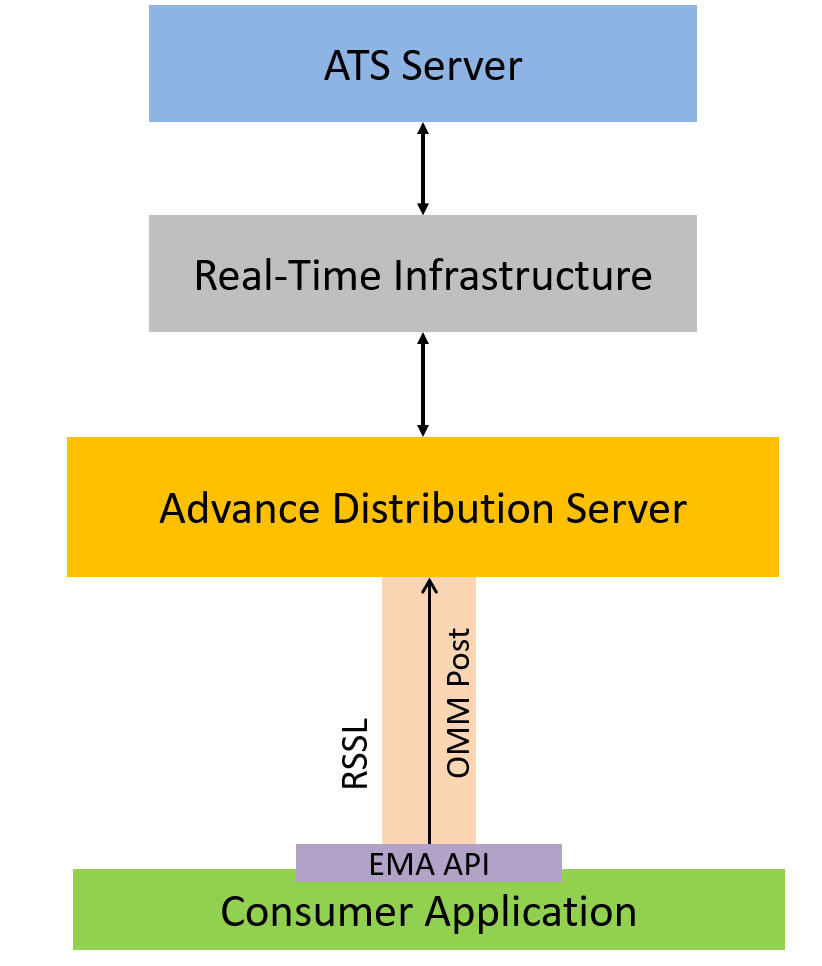

# Enterprise Message API C# edition Posting to ATS example

- Last update: Oct 2024
- Environment: Windows and Linux OS
- Compiler: C# or Docker
- Prerequisite: The Real-Time Distribution System (RTDS) with the Real-time's Advanced Transformation System (ATS)

## Overview

[Real-Time SDK (C# Edition)](https://developers.lseg.com/en/api-catalog/refinitiv-real-time-opnsrc/refinitiv-real-time-csharp-sdk) (RTSDK, formerly known as Elektron SDK) is a suite of modern and open source APIs ([GitHub](https://github.com/Refinitiv/Real-Time-SDK)) that aim to simplify development through a strong focus on ease of use and standardized access to LSEG Real-Time Platform via the proprietary TCP connection named RSSL and proprietary binary message encoding format named OMM Message. The capabilities range from low latency/high-performance APIs right through to simple streaming Web APIs.

This project covers how to implement an EMA C# consumer application to create, update market price data and delete the ATS server's contribution RIC via the Real-Time Advanced Distribution Server (ADS) with Posting feature. This project is part of the Implementing Real-Time API applications to work with ATS [part 1](https://developers.lseg.com/en/article-catalog/article/implementing-elektron-api-applications-work-ats-part-1) and [part 2](https://developers.lseg.com/en/article-catalog/article/implementing-elektron-api-applications-work-ats-part-2) articles.

The example application is implemented with C# language using RTSDK C# 2.2.2.L1 (EMA C# 3.3.0), but the main concept and the post message structures are the same for other RTSDK editions like C++ and Java.

## ATS Overview

The Real-time's Advanced Transformation System (ATS) is an analytical server that brings real-time data together from multiple sources, including internal contributed data, and transforms, centrally calculates, and publishes the resulting data onto the platform for further distribution and consumption by other applications and users.

## Posting Overview

Through posting, API consumers can easily push content into any cache within the Refinitiv Real-Time infrastructure  (i.e., an HTTP POST request). Data contributions/inserts into the ATS or publishing into a cache offer similar capabilities today. When posting, API consumer applications reuse their existing sessions to publish content to any cache(s) residing within the Refinitiv Real-Time infrastructure (i.e., service provider(s) and/or infrastructure components). When compared to spreadsheets or other applications, posting offers a more efficient form of publishing, because the application does not need to create a separate provider session or manage event streams. The posting capability, unlike unmanaged publishing or inserts, offers optional acknowledgments per posted message. The two types of posting are on-stream and off-stream:

- **On-Stream Post**: Before sending an on-stream post, the client must first open (request) a data stream for an item. After opening the data stream, the client application can then send a post. The route of the post is determined by the route of the data stream.
- **Off-Stream Post**: In an off-stream post, the client application can send a post for an item via a Login stream, regardless of whether a data stream first exists. The route of the post is determined by the Core Infrastructure (i.e., ADS, ADH, etc.) configuration.



This example covers only how to use the Off-Stream Post to contribute item to ATS server.

## Prerequisite 
1. Real-Time Distribution System infrastructure.
2. ATS server with contribution enable configurations.
3. The Real-Time Advanced Distribution Server/Real-Time Advanced Data Hub server musts contain the ATS fields definition in the RDMFieldDictionary file.

```ini
!ACRONYM    DDE ACRONYM          FID  RIPPLES TO  FIELD TYPE     LENGTH  RWF TYPE   RWF LEN
!-------    -----------          ---  ----------  ----------     ------  --------   -------
!
X_RIC_NAME "RIC NAME"              -1  NULL        ALPHANUMERIC       32  RMTES_STRING    32
X_ERRORMSG "X_ERRORMSG"            -2  NULL        ALPHANUMERIC       80  RMTES_STRING    80
X_LOLIM_FD "X_LOLIM_FD"            -3  NULL        ALPHANUMERIC       3   RMTES_STRING    3
X_HILIM_FD "X_HILIM_FD"            -4  NULL        ALPHANUMERIC       3   RMTES_STRING    3
X_LOW_LIM  "X_LOW_LIM"             -5  NULL        ALPHANUMERIC       17  RMTES_STRING    17
X_HIGH_LIM "X_HIGH_LIM"            -6  NULL        ALPHANUMERIC       17  RMTES_STRING    17
X_ARRAY    "X_ARRAY"               -7  NULL        ALPHANUMERIC       25  RMTES_STRING    25
X_BU       "X_BU"                  -8  NULL        ALPHANUMERIC       20  RMTES_STRING    20
X_CONTAINER "X_CONTAINER"          -9  NULL        ALPHANUMERIC       20  RMTES_STRING    20
X_PE       "X_PE"                  -10 NULL        ALPHANUMERIC       20  RMTES_STRING    20
X_MODEL    "X_MODEL"               -11 NULL        ALPHANUMERIC       20  RMTES_STRING    20
X_LINK     "X_LINK"                -12 NULL        ALPHANUMERIC       20  RMTES_STRING    20
X_ARGS     "X_ARGS"                -13 NULL        ALPHANUMERIC       20  RMTES_STRING    20
X_HOLIDAYS "X_HOLIDAYS"            -14 NULL        ALPHANUMERIC       255 RMTES_STRING    255
X_PPE      "X_PPE"                 -15 NULL        ALPHANUMERIC       20  RMTES_STRING    20
```
4. [.NET 8 SDK](https://dotnet.microsoft.com/en-us/download/dotnet/8.0).
5. [Docker Desktop](https://www.docker.com/products/docker-desktop/) application if you need to run an application with Docker.

Please contact your LSEG representative to help you with the RTDS and ATS configurations.

## How to Run

The first step is to unzip or download the example project folder into a directory of your choice, then follow the steps below.

**Note**: Please contact your Market Data Support team to help you with the RTDS and ATS servers configurations and setting.

1. Add the ATS fields definition on the *Prerequisite* section above to the RTDS's RDMFieldDictionary file (both ADS and ADH).
2. Restart the ADS and ADH server.
3. Enable the ATS server to accept contribution.
4. Open the *&lt;EMAConsumerATS&gt;EmaConfig.xml* file with any text editor, and then set the ADS server hostname and port on the file to match your environment.

    ```xml
    <Channel>
        <Name value="Channel_ATS"/>
        ...
        <Host value="ADS_SERVER"/>
        <Port value="14002"/>
    </Channel>
    ```
5. Open the project *EMAConsumerATS* folder in a command prompt application, then run the following command to build the project

    ```bash
    dotnet build
    ```
6. Once the build succeeded, run the following command to run the  project

    ```bash
    dotnet run -action {create, addfields, removefields, delete, update} -service {ATS Service name} -user {DACS Username } -item {RIC name to interact with ATS}
    ```

    example:

    ```bash
    dotnet run -action create -service ATS1_7 -user wasin -item NEWITEM.RIC
    ```

7. To run the project with Docker, open the *&lt;Project folder&gt;docker-compose.yml* file with any text editor and set the command as follows to match your environment:

    ```yml
    name: ema_csharp_ats

    services:
    console-ats:
        build:
        context: ./EMAConsumerATS
        dockerfile: Dockerfile
        command: -action {create, addfields, removefields, delete, update} -service {ATS Service name} -user {DACS Username } -item {RIC name to interact with ATS}
    ```

8. Then run the following command:

    ```bash
    docker compose up
    ```

9. To stop a container, run the following command:

    ```bash
    docker compose down
    ```
    
### Example Result:

```bash
dotnet run -action update -service ATS1_7

INFO|: loggerMsg
    ClientName: ChannelCallbackClient
    Severity: Info    Text:    Received ChannelUp event on channel Channel_1
        Instance Name Consumer_ATS_1
        Component Version ads3.7.3.L1.linux.rrg 64-bit
loggerMsgEnd
Consumer: Sending Login Domain Request message
Received Refresh. Item Handle: 1 Closure: LSEG.Ema.Access.OmmConsumer
Item Name: USER
Service Name: <not set>
Item State: Open / Ok / None / 'Login accepted by host 8a7869ff3e7a.'
Update ATS RIC
 Name = AllowSuspectData DataType: UInt Value: 1
 Name = ApplicationId DataType: Ascii Value: 256
 Name = ApplicationName DataType: Ascii Value: ADS
 Name = Position DataType: Ascii Value: 192.168.68.108/WIN-V793K3HCLOL
 Name = ProvidePermissionExpressions DataType: UInt Value: 1
 Name = ProvidePermissionProfile DataType: UInt Value: 0
 Name = SingleOpen DataType: UInt Value: 1
 Name = SupportEnhancedSymbolList DataType: UInt Value: 1
 Name = SupportOMMPost DataType: UInt Value: 1
 Name = SupportPauseResume DataType: UInt Value: 0
 Name = SupportStandby DataType: UInt Value: 1
 Name = SupportStandbyMode DataType: UInt Value: 3
 Name = SupportBatchRequests DataType: UInt Value: 7
 Name = SupportViewRequests DataType: UInt Value: 1
 Name = SupportOptimizedPauseResume DataType: UInt Value: 0

Received AckMsg. Item Handle: 1 Closure: LSEG.Ema.Access.OmmConsumer
AckId: 1
NackCode: <not set>
Text: [1]: Contribution Accepted
```

## <a id="troubleshooting"></a>Troubleshooting

**Question 1**: I got *Service Denied* error message when sending the Post message to the ATS server.

Example message:

```bash
Received AckMsg. Item Handle: 1 Closure: LSEG.Ema.Access.OmmConsumer
NackCode: 132
Text: [900]: Service Denied
```

**Answer**: Please add all ATS fields definition on the *Prerequisite* section above to the RTDS's RDMFieldDictionary file (both ADS and ADH). And then restart the ADS and ADH servers.

## <a id="references"></a>References

For further details, please check out the following resources:
- [Real-Time SDK C#](https://developers.lseg.com/en/api-catalog/refinitiv-real-time-opnsrc/refinitiv-real-time-csharp-sdk) page on the [LSEG Developer Community](https://developers.lseg.com/) website.
- [Real-Time SDK Family](https://developers.lseg.com/en/use-cases-catalog/refinitiv-real-time) page.
- [Real-Time SDK C# Quick Start](https://developers.lseg.com/en/api-catalog/refinitiv-real-time-opnsrc/refinitiv-real-time-csharp-sdk/quick-start).
- [Developer Article: 10 important things you need to know before you write an Enterprise Real Time application](https://developers.lseg.com/article/10-important-things-you-need-know-you-write-elektron-real-time-application).
- [Developer Webinar: Introduction to Enterprise App Creation With Open-Source Enterprise Message API](https://www.youtube.com/watch?v=2pyhYmgHxlU).
- [Implementing Real-Time API applications to work with ATS Part1](https://developers.lseg.com/en/article-catalog/article/implementing-elektron-api-applications-work-ats-part-1).
- [Implementing Real-Time API applications to work with ATS Part2](https://developers.lseg.com/en/article-catalog/article/implementing-elektron-api-applications-work-ats-part-2).

For any question related to this article or the RTSDK page, please use the Developer Community [Q&A Forum](https://community.developers.refinitiv.com/).